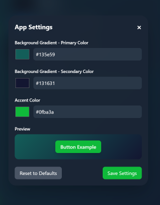

# 🎵 **Moodify**

Moodify is a sleek, AI-powered web app that reimagines Spotify — tailored to your mood and musical preferences. It allows you to:

🔍 Search for songs using the Spotify API

🎵 Play tracks (Spotify Premium required)

📝 Instantly view lyrics powered by Genius

💡 Get AI-powered song recommendations based on your mood

📁 Create new playlists from recommendations

💖 View and manage your saved playlists

🎨 Personalize your interface with custom themes

🌑 Enjoy a beautifully crafted dark mode UI with blurred, rounded, modern design

---

## 🛠 **Tech Stack**

- **Frontend**: React, Tailwind CSS, Vite  
- **Backend**: Node.js, Express, Python, Flask, Langchain, Spotipy
- **LLM**: Groq API (Mistral Saba 24B)
- **APIs**: Spotify API, Genius API  
- **Other**: Axios, Pydantic, dotenv

---

## 🎥 Demo & Screenshots

### 📸 Desktop Screenshots
#### 🎧 Now Playing Interface


#### 🤖 Mood-Based Recommendations


#### 🔍 Song Search Page


#### ⚙️ Settings & Theme Selection


### 📱 Mobile Screenshots

#### 🎧 Now Playing on Mobile


#### 🤖 AI Suggestions on Mobile


#### 📝 Lyrics View on Mobile


#### ⚙️ Settings Panel on Mobile


---

## ⚙️ **Setup Instructions**

To get started with this project, follow the steps below:

### 1. **Clone the Repository**  
Clone the repository to your local machine:
```bash
git clone https://github.com/yourusername/better-spotify.git
```

### 2. **Install Dependencies**

#### Frontend (React):  
Navigate to the frontend folder and install the necessary dependencies:
```bash
cd betterSpotify
npm install
```

#### Backend (Express):  
Navigate to the backend folder and install the necessary dependencies:
```bash
cd server
npm install
```

### 3. **Add Environment Variables**  
In both the frontend and backend folders, you will need to add the necessary API keys to `.env` files.

#### Frontend:  
Inside the `betterSpotify` folder, create a `.env` file and add:
```env
VITE_SPOTIFY_CLIENT_ID=your_spotify_client_id
VITE_SPOTIFY_REDIRECT_URI=http://127.0.0.1:5173
VITE_BACKEND_URL=http://127.0.0.1:3001
VITE_MLBACKEND_URL=http://127.0.0.1:5000
```

#### Backend:  
Inside the `server` folder, create a `.env` file and add:
```env
SPOTIFY_CLIENT_ID=your_spotify_client_id
SPOTIFY_CLIENT_SECRET=your_spotify_client_secret
SPOTIFY_REDIRECT_URI=http://127.0.0.1:5173
GENIUS_ACCESS_TOKEN=your_genius_access_token
FRONTEND_URL=http://127.0.0.1:5173
```

Replace `your_spotify_client_id`, `your_spotify_client_secret`, and `your_genius_access_token` with your actual API credentials. Change the URLs according to your setup.

---

## 🚀 **How to Run**

### Running the Frontend  
In the `betterSpotify` folder, run:
```bash
npm run dev
```
This will start the React development server at `http://127.0.0.1:5173`.

### Running the Backend  
In the `server` folder, run:
```bash
npm run devStart
```
This will start the Express server at `http://127.0.0.1:3001`.

### Running the AI Agent Backend  
In the `MLBackend` folder, run:
```bash
python app.py
```
This will start the Flask server at `http://127.0.0.1:5000`.

---

## 💡 **Features**

- **Spotify Login**: Securely sign in with your Spotify account to access your playlists and playback. 🎧

- **Search & Play**: Instantly search the entire Spotify catalog and play songs (requires Spotify Premium). 🔍🎶

- **Real-Time Lyrics**: View live song lyrics pulled directly from Genius as your music plays. 📝

- **Mood-Based AI Recommendations**: Get smart, mood-aware song suggestions powered by AI — and add them to a playlist in one click. 🤖🎵

- **Playlist Management**: Browse and manage your saved playlists or create new ones from recommended tracks. 📁💖

- **Custom Themes**: Personalize your experience with multiple themes — using a fully custom theme mode. 🎨🌈

- **Modern Dark UI**: Enjoy a beautifully designed dark interface with soft blur, rounded elements, and a minimal aesthetic. 🌑✨

---

## 🤝 **Contributing**  
Feel free to submit issues or pull requests if you want to contribute. Contributions are welcome! 💻✨
